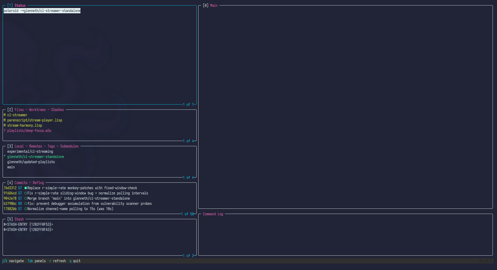
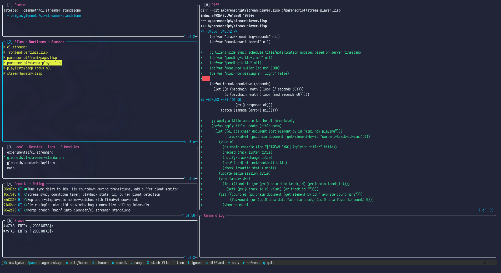

# Gilt

**Git Interface for Lisp Terminal**

A LazyGit-style Git TUI written in Common Lisp.

## Screenshots

### Main View


### Diff View


## Features

- **Pure ANSI rendering** - No ncurses dependency, direct terminal control
- **LazyGit-inspired UI** - Familiar 5-panel layout with colored output
- **Full color diffs** - 256-color support with syntax highlighting
- **Fast and responsive** - Lightweight terminal interface
- **CLOS architecture** - Clean, extensible object-oriented design
- **Comprehensive Git operations** - Stage, commit, push, pull, merge, rebase, cherry-pick, and more
- **Interactive rebase** - Full rebase UI with pick, reword, squash, fixup, drop, and reorder
- **Bisect** - Binary search for bad commits with `b`:bad `g`:good `Q`:reset
- **Git blame view** - View file blame with commit info
- **Commit search** - Filter commits by message or author
- **Tag support** - Create, delete, push, and view tags
- **Remote management** - Add, rename remotes; delete remote branches; fetch
- **Submodule support** - View and update submodules
- **Worktree management** - View, add, and remove working directories
- **Stash management** - List, apply, pop, drop, and rename stashes
- **Config viewer** - Browse git config (local/global/system)
- **Git-flow integration** - Feature, release, and hotfix workflows
- **Merge conflict resolution** - Resolve with ours/theirs/edit, abort merge
- **Force push** - Push with `--force-with-lease` option
- **Context-sensitive hints** - Help bar updates based on active panel and view
- **Custom keybindings** - Define shell commands in `~/.config/gilt/commands.conf`
- **Status bar** - Branch tracking info and operation status
- **Cross-platform Unix support** - Works on NixOS, standard Linux, macOS, WSL2

## Requirements

- SBCL (Steel Bank Common Lisp)
- Quicklisp
- Git

## Installation

### Build Standalone Executable

```bash
make build
```

This creates a `gilt` executable you can run directly:

```bash
./gilt
```

### Install System-Wide

```bash
sudo make install
```

Then run from anywhere:

```bash
gilt
```

## Quick Start

1. Navigate to a Git repository
2. Run `./gilt` (or `gilt` if installed)
3. Use `j`/`k` to navigate, `Tab` to switch panels
4. Press `Space` to stage files, `c` to commit
5. Press `q` to quit

## Documentation

See **[GUIDE.md](GUIDE.md)** for the complete user guide including:

- Screen layout and panel descriptions
- All keybindings
- Common workflows (staging, committing, merging, squashing, etc.)
- New features: blame view, commit search, tags, remotes, submodules, worktrees, config viewer
- Troubleshooting tips

See **[CHANGELOG.md](CHANGELOG.md)** for version history.

## Architecture

| File | Description |
|------|-------------|
| `ansi.lisp` | ANSI escape sequence library |
| `terminal.lisp` | Raw terminal input handling |
| `ui.lisp` | Panel and dialog drawing |
| `git.lisp` | Git command interface |
| `views.lisp` | Main UI views |
| `main.lisp` | Application entry point |

## Makefile Targets

| Target | Description |
|--------|-------------|
| `build` | Build standalone executable |
| `install` | Install to /usr/local/bin |
| `uninstall` | Remove from /usr/local/bin |
| `clean` | Remove build artifacts |
| `run` | Run from source |

## License

MIT
